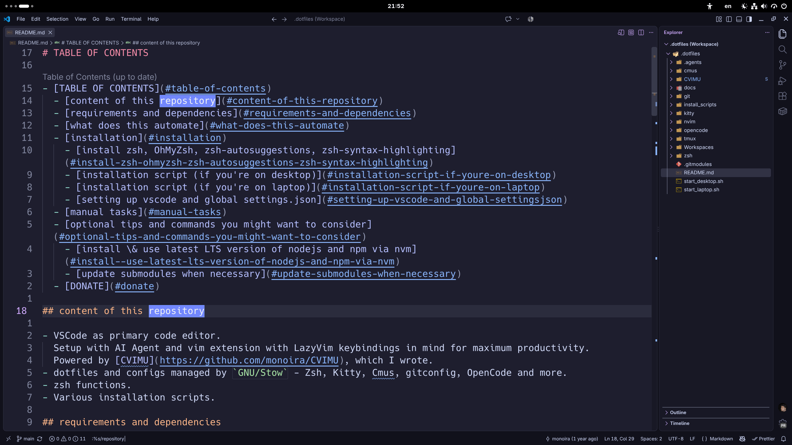
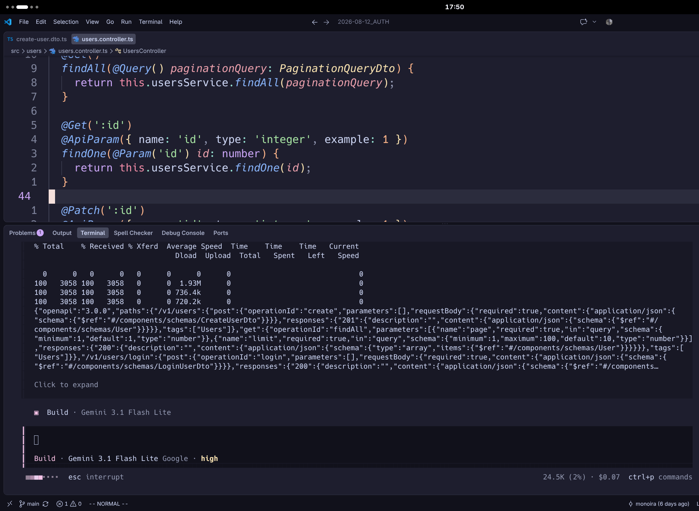
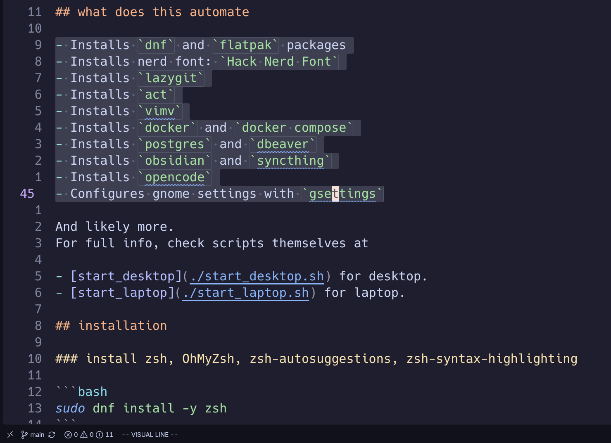
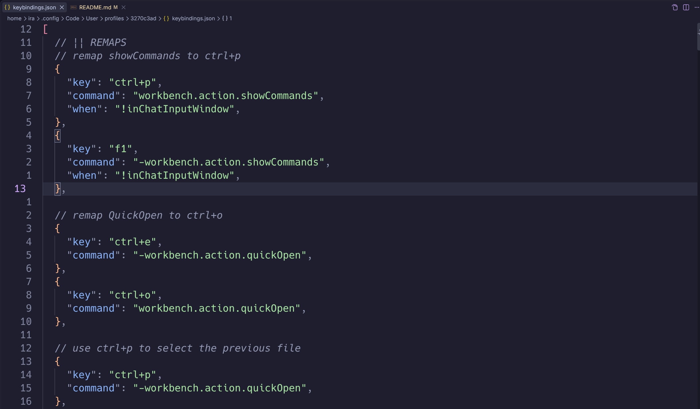

# CVIMU

- [CVIMU](#cvimu)
  - [DEPENDENCIES](#dependencies)
  - [HOW](#how)
    - [for Linux](#for-linux)
    - [for MacOS (untested)](#for-macos-untested)
    - [for Windows (untested)](#for-windows-untested)
  - [WORKSPACES AND HOW TO USE THEM](#workspaces-and-how-to-use-them)
  - [KEYBINDINGS](#keybindings)
    - [fixes to VSCode](#fixes-to-vscode)
    - [navigation](#navigation)
    - [QuickOpen and workspace switching](#quickopen-and-workspace-switching)
    - [editors / buffers](#editors--buffers)
    - [file explorer](#file-explorer)
    - [AI](#ai)
    - [GOTOs](#gotos)
    - [hover over code](#hover-over-code)
    - [warnings and diagnostics](#warnings-and-diagnostics)
    - [integrated terminal](#integrated-terminal)
    - [search](#search)
    - [fold](#fold)
    - [code actions](#code-actions)
  - [DONATE](#donate)

CODE-VIM-ULTIMATE aka CVIMU is a Visual Studio Code setup with:

- Vim Extension.
- [LazyVim](https://www.lazyvim.org/keymaps)-like global keybindings.
- Somewhat compatible with [Obsidian](https://obsidian.md), same keybindings like `ctrl o` and `ctrl p` for opening recent files and command palette instead of LazyVim's ones, as well as few others.
- Custom Keybindings for Copilot Chat & Copilot Autocomplete (you can change / remove in `settings.json` and `keybindings.json`).

plus sensible defaults and [fixes to VSCode](#fixes-to-vscode) for maximum productivity and comfort.






```bash
├── docs
│   ├── 1-showcase.png
│   ├── 2-showcase.png
│   ├── 3-showcase.png
│   └── 4-showcase.png
├── profiles
│   └── prof.code-profile
├── README.md
├── settings.json
└── Workspaces
    └── WORKSPACES AND HOW TO USE THEM
```

Extensions in [profile](./profiles/prof.code-profile):

- ESLint
- Prettier - Code formatter
- Container Tools
- Paste JSON as Code
- Code Spell Checker
- VSCode-icons
- Vim
- YAML
- Catppuccin for VSCode
- ES7+ React/Redux/React-Native snippets
- Tailwind CSS IntelliSense
- Postman
- Markdown All in One
- markdownlint
- Bash IDE

## DEPENDENCIES

`markdownlint`  
required for `markdownlint` extension.
install it or uninstall `markdownlint` extension.

`shfmt` and `shellcheck`  
required for `Bash IDE` extension.
install those or uninstall `Bash IDE` extension.

## HOW

**NOTE:**
Due to how VSCode works, you must first open VSCode at least once for creation of `Code/User` directory.

**prerequisites:**

- have dotfiles directory.
- basic knowledge of vim keybindings, json and git.

**this project is made of three parts:**

- [profiles/prof.code-profile](profiles/prof.code-profile)
- [global settings.json](./settings.json)
- **optional** [Workspaces](./Workspaces/) directory where you can export and keep your VSCode workspaces.

you can clone this project inside your `.dotfiles`  
then remove [docs](./docs/) and .git  
then you can import [profile](./profiles/prof.code-profile)  
**then** symlink global `settings.json`.
That's it.

### for Linux

symlinking global `settings.json`

```bash
ln -sf "$HOME/.dotfiles/CVIMU/settings.json" "$HOME/.config/Code/User/settings.json"
```

### for MacOS (untested)

symlinking global `settings.json`

```bash
ln -sf "$HOME/.dotfiles/CVIMU/settings.json" "$HOME/Library/Application Support/Code/User/settings.json"
```

### for Windows (untested)

symlinking global `settings.json`

```powershell
New-Item -ItemType SymbolicLink `
  -Path "$env:APPDATA\Code\User\settings.json" `
  -Target "$HOME\.dotfiles\CVIMU\settings.json"
```

## WORKSPACES AND HOW TO USE THEM

- Export your workspaces to your `.dotfiles/CVIMU/Workspaces` via `File > Save Workspace As...`
- go to containing directory of them all
- select them all with `ctrl` + `a`
- drop them all in opened VSCode instance

## KEYBINDINGS

### fixes to VSCode

- `<leader>` is set to `space`.
- extension updates are disabled by default to reduce interruptions.
  You can update extensions by going to `extensions > check for extension updates`.

| Keybinding   | Feature                                  |
| ------------ | ---------------------------------------- |
| `<C-d>`      | Scroll down half page and center         |
| `<C-u>`      | Scroll up half page and center           |
| `ctrl n`     | Down (when given a dropdown)             |
| `ctrl p`     | Up (when given a dropdown)               |
| `<leader> e` | Open file explorer (with focus)          |
| `ctrl b`     | Close / open explorer (no focus, toggle) |

### navigation

| Keybinding            | Feature                                   |
| --------------------- | ----------------------------------------- |
| `alt h`               | Focus to left pane                        |
| `alt l`               | Focus to right pane                       |
| `s`                   | Search word (EasyMotion)                  |
| `<leader> <leader> b` | Jump to word (before cursor) (EasyMotion) |
| `<leader> <leader> w` | Jump to word (after cursor) (EasyMotion)  |

### QuickOpen and workspace switching

| Keybinding                  | Feature                                |
| --------------------------- | -------------------------------------- |
| `ctrl o`                    | QuickOpen file in a new tab            |
| `<leader> f p`              | Open recent workspaces                 |
| `<leader> f p`+`ctrl enter` | Open recent workspaces in a new window |

### editors / buffers

| Keybinding     | Feature                       |
| -------------- | ----------------------------- |
| `[ b`          | Previous editor tab           |
| `] b`          | Next editor tab               |
| `[ B`          | Move editor left              |
| `] B`          | Move editor right             |
| `alt {NUMBER}` | Go to editor {NUMBER}         |
| `ctrl shift t` | Reopen recently closed editor |
| `ctrl w`       | Close current editor          |
| `<leader> b d` | Close current editor          |
| `<leader> b r` | Close editors to the right    |
| `<leader> b l` | Close editors to the left     |
| `<leader> b o` | Close all other editors       |

### file explorer

| Keybinding   | Feature                                          |
| ------------ | ------------------------------------------------ |
| `<leader> e` | Focus file explorer                              |
| `a`          | Create a new file                                |
| `f`          | Create a new directory                           |
| `d`          | Delete selected file/directory                   |
| `y`          | Copy selected file/directory                     |
| `p`          | Paste into selected directory                    |
| `x`          | Cut selected file/directory                      |
| `r`          | Rename selected file/directory                   |
| `o`          | Reveal file/directory in OS file manager         |
| `ctrl alt r` | Open containing folder of focused file/directory |

### AI

| Keybinding   | Feature                  |
| ------------ | ------------------------ |
| `ctrl i`     | Copilot inline chat `AI` |
| `ctrl alt i` | Copilot chat `AI`        |

### GOTOs

| Keybinding     | Feature               |
| -------------- | --------------------- |
| `g d`          | Go to definition      |
| `g D`          | Go to declaration     |
| `g f`          | Go to file            |
| `g i`          | Go to implementation  |
| `g r`          | Go to references      |
| `g h`          | Go to call hierarchy  |
| `g y`          | Go to type definition |
| `<leader> g g` | Focus source control  |

### hover over code

| Keybinding | Feature              |
| ---------- | -------------------- |
| `K`        | Show hover info      |
| `g K`      | Show parameter hints |

### warnings and diagnostics

| Keybinding | Feature             |
| ---------- | ------------------- |
| `] d`      | Next diagnostic     |
| `[ d`      | Previous diagnostic |
| `] e`      | Next error          |
| `[ e`      | Previous error      |
| `] w`      | Next warning        |
| `[ w`      | Previous warning    |

### integrated terminal

| Keybinding     | Feature                           |
| -------------- | --------------------------------- |
| `alt {NUMBER}` | go to terminal {NUMBER}           |
| `ctrl t`       | create new terminal               |
| `ctrl w`       | delete active terminal            |
| `ctrl i`       | Copilot inline terminal chat `AI` |

### search

| Keybinding     | Feature                                 |
| -------------- | --------------------------------------- |
| `ctrl p`       | Open command palette                    |
| `<leader> s d` | Toggle problems panel                   |
| `<leader> s r` | Search and replace                      |
| `<leader> s s` | Go to symbol in current file            |
| `ctrl shift o` | Go to symbol in current file            |
| `<leader> s S` | Go to symbol in a whole workspace       |
| `<leader> /`   | Quick text search in a whole repository |

### fold

| Keybinding | Feature     |
| ---------- | ----------- |
| `za`       | toggle fold |
| `zR`       | unfold all  |
| `zc`       | fold        |
| `zo`       | open fold   |

### code actions

| Keybinding     | Feature               |
| -------------- | --------------------- |
| `<leader> c a` | Quick fix             |
| `<leader> c A` | Source action         |
| `<leader> c r` | Rename symbol         |
| `<leader> c p` | Preview markdown      |
| `<leader> c u` | Remove unused imports |

**Disclaimer**  
This project is purely a community-driven configuration setup and is not officially affiliated with or endorsed by Visual Studio Code (Microsoft), LazyVim, or any other commercial software vendor.
Use this configuration at your own risk. I make no guarantees regarding compatibility, stability, or fitness for any particular purpose.

## DONATE

I've been creating FOSS / GNU/Linux / nvim / web
related software for some time now.  
If you used, forked or took code from one of my projects and you
would like to support me 👍,  
you can donate here:

| type                | address                                    |
| ------------------- | ------------------------------------------ |
| Bitcoin (SegWit)    | bc1ql8sp9shx4svzlwv0ckzv8s7pphw5upvmt8m2m7 |
| Ethereum (Ethereum) | 0xf2FCB0Af39DF7A608b76297e45181aF23fEB939F |
